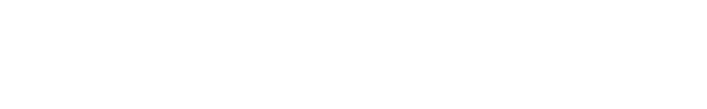

# FFmpeg-lambda
Static FFmpeg built with [dumpwave filter patch](https://patchwork.ffmpeg.org/project/ffmpeg/patch/20190107143115.101095-1-dhumeniuk@google.com)  
Purpose: Transcode audio, calculate RMS amplitude envelope in json format [example usage](https://git.io/JkgX8)  

Python wrapper - Fetches audio file, transcode (sending progress to queue/pubsub), upload results to separate bucket  
AWS: Just set index.py#handler() as S3 'Put' Event notification handler  
GCP `git checkout gcp`: Simply set main.py#handler() as Storage 'Create/Finalize' Event notification handler
